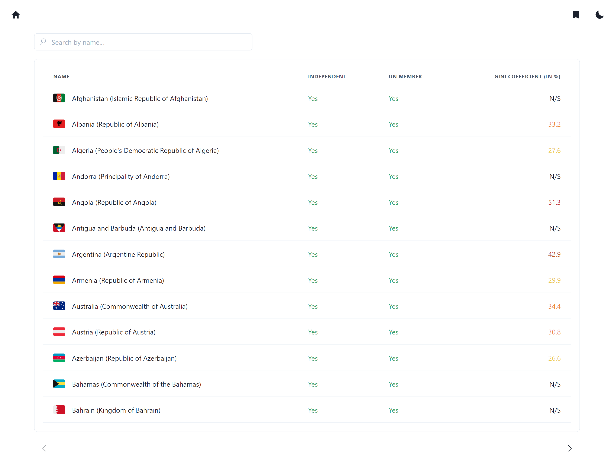
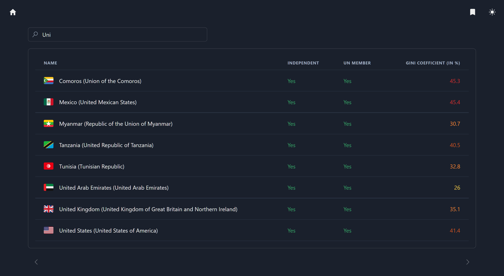
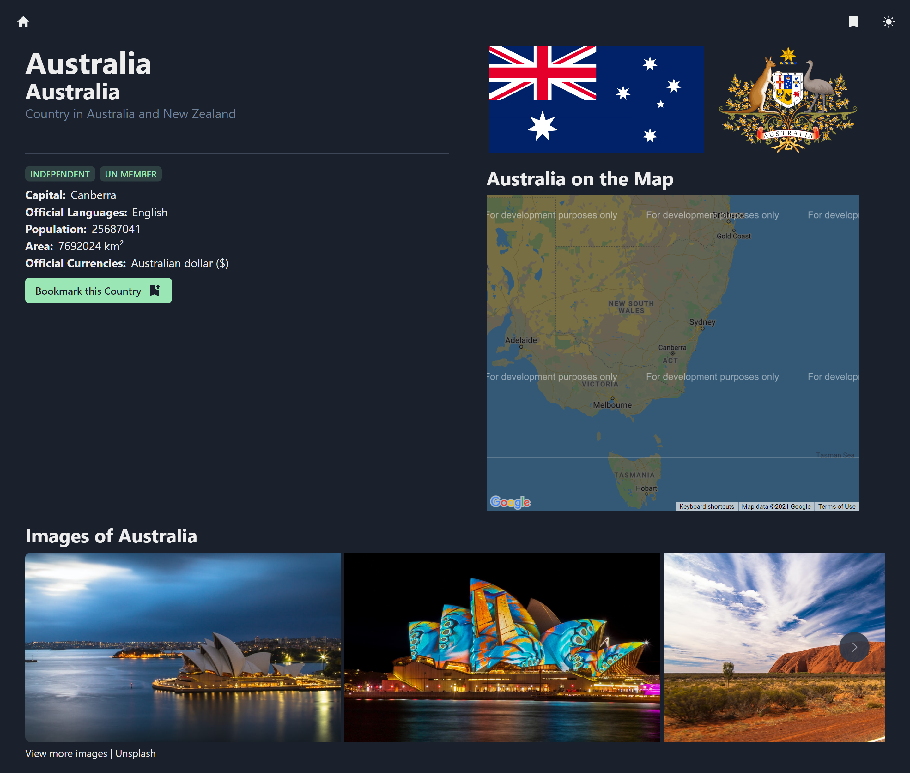
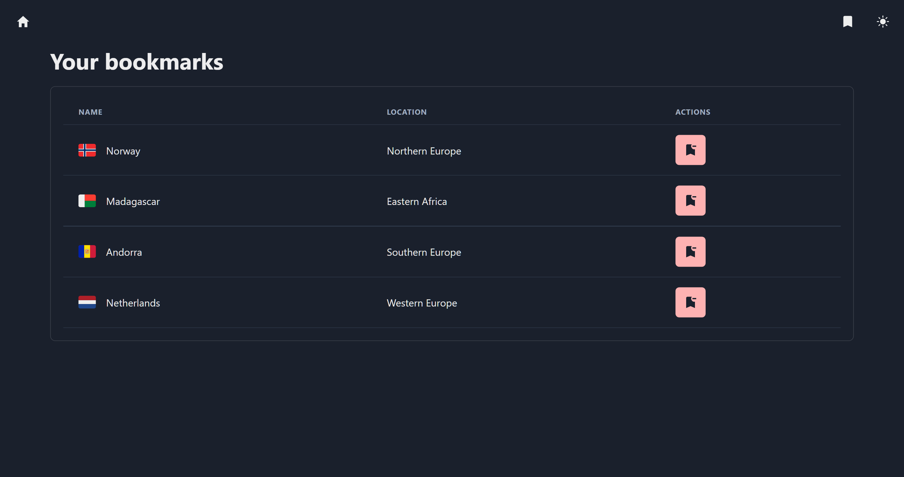
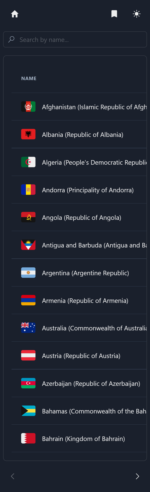

# Lands

[Live Preview](https://lands-vzcatus13.netlify.app/)

Lands is the front-end web application which _I wrote to advance my knowledge of React ecosystem_.

As the result for styling I choose **Chakra UI**, because it's beginner-friendly and has all primitive components out of the box (with style props and accessability features). Material UI and Ant Design also were considered: they have more robust components, but for this project they are just overkill (customizing and other things like bundle size).\
For routing I choose **React Router**.\
For API calls I used **React Query** (loved caching management, DevTools for debugging and both REST & GraphQL support) with simple fetch.\
Objectively this project does not need any state management library and can utilize simple React Context, but for the sake of educational reason I use **Redux Toolkit with async actions**.\
Also I tried to use React Table and played with virtualization.

## Typescript

There is a **Typescript version** of this app on [typescript branch](/../../tree/typescript).\
App was typescripted (after it was finished), because I was learning TS.

## Run Locally

Clone this repository\
`$ git clone https://github.com/vzcatus13/lands`

Install dependencies (Node.js and npm required)\
`npm i`

_NB In real world experience it's better to create API Gateway for Unsplash or any key-based API to hide secret keys from users_

Write yours API keys for Google Maps (without key Maps will work in development mode, so it can be omitted) and Unsplash in `.env.development.local` file for development and `.env.production.local` file for build (example of .env file is in [`.env.example.local`](./.env.example.local))

Start application\
`npm start`

## Full-Sized Screenshots

### Desktop

### Mobile

## Help (Contribute)

If you somehow seeing this message and you're not robot, you can help me with any human advice (because this project is educational) by peer reviewing it, including, but not limited to, code styles, files and folder structure, best, but not overkilled, practices. To advise [open issue](/../../issues) or [email me](mailto:vzcatus13@protonmail.ch?subject=[GitHub]%20Advice%20on%20Lands).
